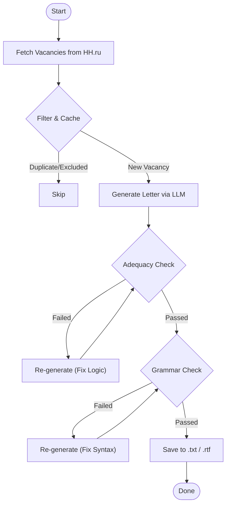

# JobHuntAssistant 🤖

**Automated Job Search & Cover Letter Generator powered by Local LLM.**


## 📖 Overview

JobHuntAssistant is an intelligent agent designed to automate the routine part of job hunting on HeadHunter (hh.ru). Instead of generic templates, it uses a **Local LLM** (via Ollama) to read vacancy details and generate a hyper-personalized cover letter for each position.

It features a unique **Self-Correction Loop**: the AI generates a draft, then critiques its own work for adequacy and punctuation, refining the result before saving.

### 🧠 Logic Flow



## 🚀 Key Features

* **Smart Filtering:** Filters vacancies by keywords, salary, and experience levels (excluding irrelevant titles via `EXCLUDE` list).
* **Context-Aware AI:** The LLM reads the *specific* requirements of the vacancy and maps them to your `PERSONAL_DATA` and `SKILLS`.
* **Quality Assurance (Reflexion):**
    * **Adequacy Rounds:** The system asks the AI: *"Does this letter actually answer the job requirements?"* If not, it rewrites it.
    * **Punctuation Rounds:** Final polish for grammar and style.
* **Export Utility:** Includes a tool to compile all generated letters into a single `.rtf` file for easy review.
* **Privacy First:** Runs locally using Ollama — your personal data never leaves your machine.

## 🛠 Tech Stack

* **Core:** Python 3.11
* **AI:** Ollama (Llama 3, Mistral, or YandexGPT via GGUF)
* **Data:** Requests, JSON, File-based Caching
* **Infrastructure:** Docker & Docker Compose

## ⚙️ Installation & Setup

### 1. Prerequisites
You need [Ollama](https://ollama.com/) running locally or accessible via network.
```bash
ollama pull llama3  # or your preferred model
```

### 2. Clone & Configure
```bash
git clone [https://github.com/S1erben13/JobHuntAssistant.git](https://github.com/S1erben13/JobHuntAssistant.git)
cd JobHuntAssistant
cp .env.example .env
```

### 3. Environment Variables (`.env`)
Fill in your details to make the letters truly yours:

```ini
# AI Settings
LLM_MODEL=llama3
ADEQUACY_ROUNDS=2       # How many times AI fixes logic
PUNCTUATION_ROUNDS=1    # How many times AI fixes grammar

# Job Search Filters
MAIN_QUERY="Python Developer"
SALARY=80000
EXPERIENCE=between1And3,noExperience
EXCLUDE=Senior,Lead,Java,PHP

# Your Profile
PERSONAL_DATA="Name: Vladimir... Contacts:..."
```
*Note: Key skills should be placed in `prompts/data/skills.txt`.*

## 🏃 Usage

### Option A: Docker (Recommended)
The container handles the environment setup automatically.

```bash
docker-compose up --build
```

### Option B: Local Python
```bash
pip install -r requirements.txt
python run.py
```

### 🎁 Bonus: Export to Word/RTF
After processing vacancies, you can merge all generated text files into one document for bulk review:

```bash
python generate_rtx.py
```
*This creates `cover_letters.rtf` and moves processed logs to the archive.*

---
*Created by [Vladimir Popov](https://github.com/S1erben13)*
